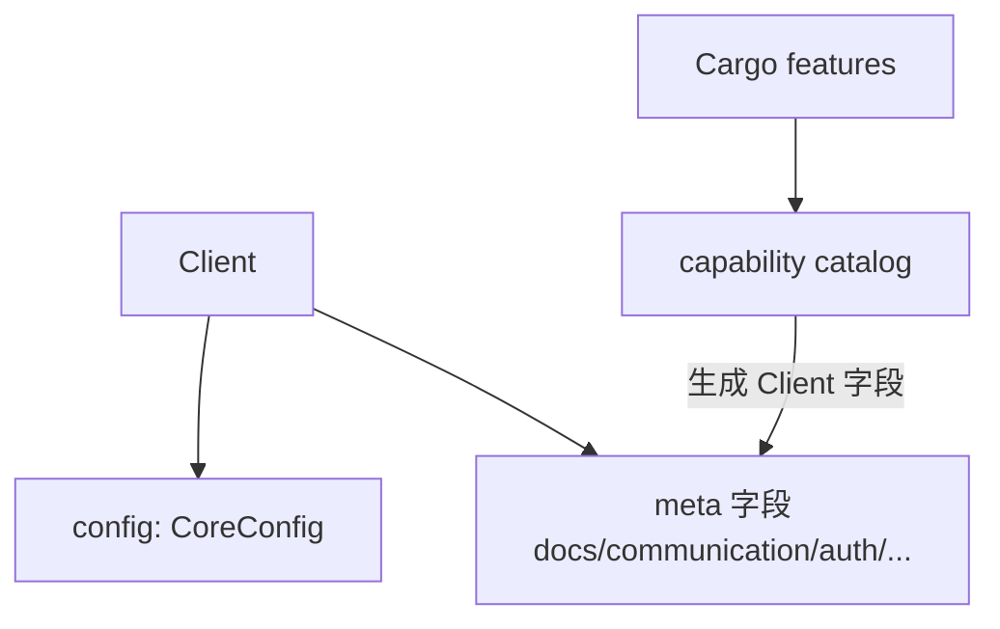

# OpenLark Client

现代化的 Rust 客户端库，为飞书开放平台提供类型安全的 API 访问。

> 普通用户请优先使用根 crate `openlark`。
>
> `openlark-client` 适合已经明确需要统一 `Client` 实现细节、或只想直接复用客户端层的高级用户。
>
> Canonical 公开入口规则见 [`../../docs/PUBLIC_REEXPORT_POLICY.md`](../../docs/PUBLIC_REEXPORT_POLICY.md)。

## 🚀 特性

### ✨ **架构优势**

- **模块化设计**: 通过 feature 标志实现服务解耦
- **条件编译**: 只编译需要的服务，优化二进制大小
- **类型安全**: 编译时类型检查，避免运行时错误
- **向后兼容**: 提供兼容现有代码的迁移路径

### 🎯 **核心功能**

- **1,000+ API 支持**: 覆盖飞书开放平台主要功能
- **错误处理**: 企业级错误处理和恢复机制
- **性能优化**: 共享配置和内存优化
- **构建器模式**: 流畅的 API 配置体验

## 📦 安装

在 `Cargo.toml` 中添加：

```toml
[dependencies]
openlark-client = { version = "0.18.0", features = ["docs"] }
```

### 功能标志

```toml
# 默认启用：auth + communication（如需关闭：default-features = false）

# 文档服务（会启用 openlark-docs）
features = ["docs"]

# 通信服务（会启用 openlark-communication；默认已启用）
features = ["communication"]

# 认证服务（默认已启用）
features = ["auth"]

# CardKit（卡片能力，meta 调用链）
features = ["cardkit"]

# 会议服务
features = ["meeting"]

# WebSocket 支持
features = ["websocket"]

# 组合功能（P0 推荐）
features = ["p0-services"]
```

如果你只是要接入 SDK，而不是直接依赖客户端实现层，推荐改用：

```toml
[dependencies]
openlark = { version = "0.18.0", features = ["essential"] }
```

## 入口定位

- canonical 高级入口：`openlark_client::Client` / `ClientBuilder`
- canonical 调用方式：`client.auth`、`client.communication`、`client.docs`、`client.hr`
- 非默认推荐场景：普通业务应用直接把 `openlark-client` 当作根入口

> #471 移除了 speculative 的 `ServiceRegistry` / traits / lazy 半边（零外部消费者）。
> 本 crate 现只保留 `Client` 的 meta 链式字段访问；不再提供 metadata-only registry。

## 🧩 meta 调用链（按 CSV 映射）

本仓库提供一种"调用路径与 `api_list_export.csv` 的 `meta.*` 字段一一对应"的访问方式：

`client.{meta.Project}.{meta.Version}.{meta.Resource}.{meta.Name}(...)`

规范与示例见：`crates/openlark-client/docs/meta-api-style.md:1`

## 🔧 快速开始

README 对齐的可编译示例见 `examples/client_readme_examples.rs`。

### 基础用法

```rust,no_run
use openlark_client::prelude::*;
use std::time::Duration;

fn main() -> Result<()> {
    // 使用构建器创建客户端
    let _client = Client::builder()
        .app_id("your_app_id")
        .app_secret("your_app_secret")
        .base_url("https://open.feishu.cn")
        .timeout(Duration::from_secs(30))
        .build()?;
    Ok(())
}
```

### 从环境变量创建

```rust,no_run
use openlark_client::prelude::*;

fn main() -> Result<()> {
    // 需要配置 OPENLARK_APP_ID / OPENLARK_APP_SECRET
    let _client = Client::from_env()?;
    Ok(())
}
```

### 使用 CoreConfig

`Client::builder()` 是普通入口；如果你已经在底层模块中构建了 `openlark_core::config::Config`，可以直接传给 `Client::with_core_config()`：

```rust,no_run
use openlark_client::prelude::*;

fn main() -> Result<()> {
    let config = CoreConfig::builder()
        .app_id("your_app_id")
        .app_secret("your_app_secret")
        .base_url("https://open.feishu.cn")
        .build();

    let _client = Client::with_core_config(config)?;
    Ok(())
}
```

## 🎪 服务访问

### meta 单入口（推荐）

```rust,no_run
use openlark_client::prelude::*;

fn main() -> Result<()> {
    let client = Client::from_env()?;

    // 文档入口（需启用 docs feature）
    #[cfg(feature = "docs")]
    let _docs_config = client.docs.config();

    // 通讯入口（需启用 communication feature，默认启用）
    #[cfg(feature = "communication")]
    let _comm = &client.communication;

    Ok(())
}
```

### 配置访问

```rust,no_run
use openlark_client::prelude::*;

fn main() -> Result<()> {
    let client = Client::from_env()?;

    // 统一配置入口（inherent 方法）
    let _cfg = client.config();
    assert!(client.is_configured());

    Ok(())
}
```

## 🔄 迁移指南

### 从 0.18 的 registry / traits 迁移（0.19 breaking）

#471 移除了零外部消费者的 speculative 表面。如果你曾使用这些 API：

```rust,ignore
// 已移除（0.19）—— 改用下述等价方式
let _ = client.registry();                 // metadata-only 诊断：已删
let _ = client.handle_error(...);          // ClientErrorHandling trait：改用 client.execute_with_context(op, fut).await
use openlark_client::LarkClient;           // trait：改用 Client 固有方法 client.config() / client.is_configured()
```

仅走 `client.<domain>` 字段访问的代码**零影响**。

## 🏗️ 架构设计

### 能力目录（capability catalog）



**说明**：
- **编译期**: Cargo features 决定哪些 meta client 字段被 `capability` catalog 编译进 `Client`。
  catalog 是 Client 字段的单一事实来源（`feature`/`field`/`ty`/`doc`/`init`）。
- **编译期保证**: 字段标识符唯一、禁用 feature 不产 Client 字段，由
  `openlark-capability-unique` trybuild crate（workspace 成员）覆盖。
- **运行期**: `Client` 只暴露 meta 链式字段访问与配置；不再有 registry / lifecycle trait
  （#471 移除零消费者的 speculative 半边）。

## 🧪 测试

```bash
# 运行所有测试
cargo test -p openlark-client

# 测试特定功能
cargo test -p openlark-client --features docs

# 无功能测试
cargo test -p openlark-client --no-default-features

# 全功能测试
cargo test -p openlark-client --all-features
```

## 📚 文档

- **API 文档**: `cargo doc -p openlark-client --open`
- **Meta API 规范**: `crates/openlark-client/docs/meta-api-style.md`
- **核心概念**: 参见飞书开放平台官方文档

## 🤝 贡献

欢迎提交 Issue 和 Pull Request！

## 📄 许可证

Apache License 2.0
